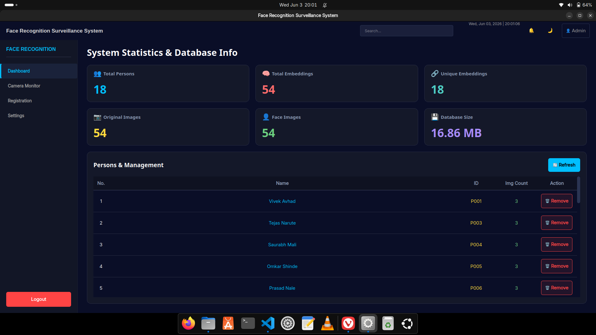
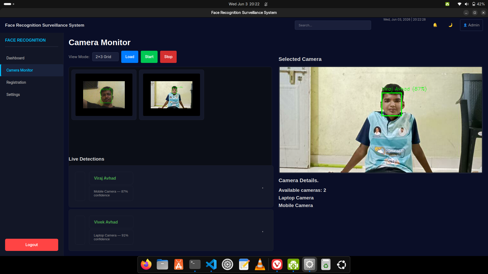
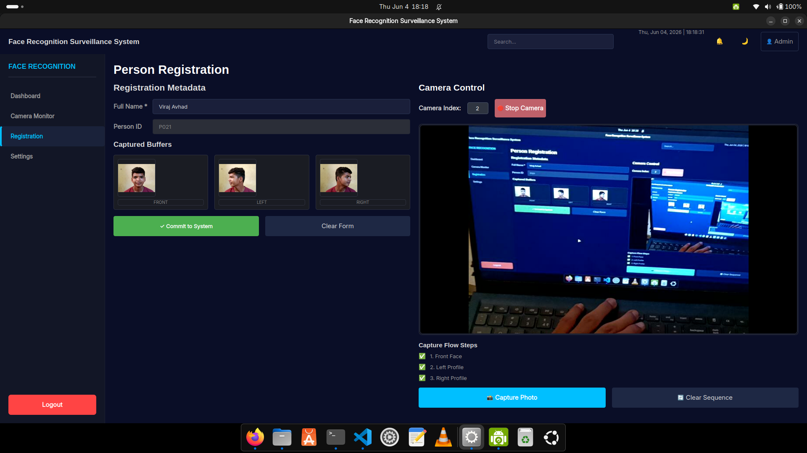
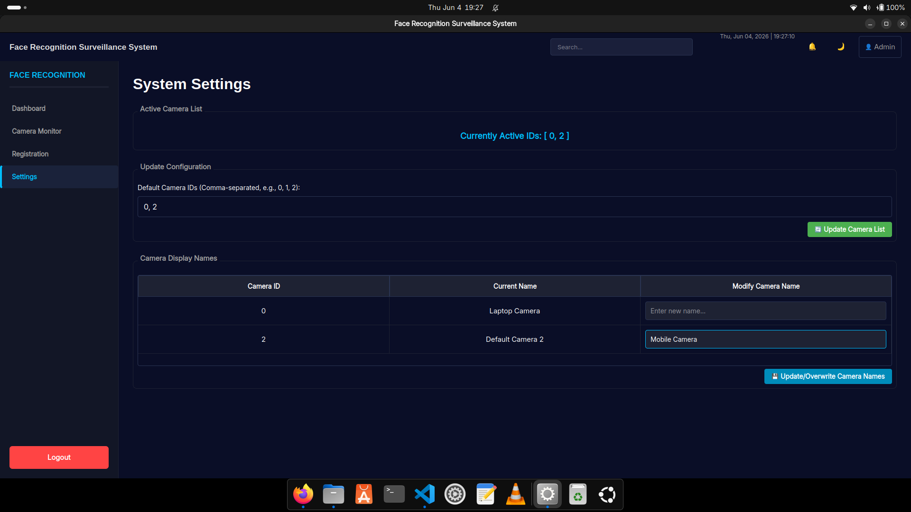

# 🎯 Face Recognition Surveillance System

> A professional desktop application for real-time multi-camera face detection, recognition, and person management — built with Python, PySide6, and deep learning.


---

## 📋 Table of Contents

- [Overview](#overview)
- [Features](#features)
- [Tech Stack](#tech-stack)
- [Project Structure](#project-structure)
- [Installation](#installation)
- [Usage](#usage)
- [Application Screens](#application-screens)
- [Database Schema](#database-schema)
- [Configuration](#configuration)
- [Troubleshooting](#troubleshooting)
- [Roadmap](#roadmap)

---

## Overview

A full-featured surveillance desktop app with a modern dark-themed GUI. It monitors multiple camera feeds simultaneously, detects and recognizes faces in real time using FaceNet embeddings, and maintains a self-healing dataset with automatic consistency validation.

---

## Features

- **Multi-Camera Live Monitoring** — Simultaneous streams with configurable grid layouts (2×2, 1×4, 2×3)
- **Face Detection** — MTCNN (Multi-task Cascaded Convolutional Networks)
- **Face Recognition** — FaceNet InceptionResnet-V1 with cosine similarity matching (default threshold: 85%)
- **3-Angle Person Registration** — Front, left, and right captures for robust recognition
- **Self-Healing Dataset** — Automatic validation and repair of orphaned CSV rows or missing images on startup
- **System Dashboard** — Live stats: registered persons, embeddings, image counts, and database size
- **Thread-Safe Architecture** — Background workers for camera streams and long operations; UI never freezes
- **Cross-Platform Camera Backends** — Auto-selects V4L2 (Linux), DirectShow (Windows), or AVFoundation (macOS)

---

## Tech Stack

| Layer | Technology |
|-------|------------|
| GUI | PySide6 (Qt for Python), dark theme via `.qss` |
| Computer Vision | OpenCV (cv2) — capture, resize, overlay drawing |
| Face Detection | MTCNN (facenet-pytorch) |
| Face Recognition | FaceNet InceptionResnet-V1 (512-dim embeddings) |
| ML Backend | PyTorch, NumPy, Scikit-learn |
| Data | CSV (metadata) + NPZ (binary embeddings) |

---

## Project Structure

```
FaceRecognitionSystem/
│
├── run_frontend.py              # Entry point
│
├── frontend/
│   ├── main_window.py           # Window management & page routing
│   ├── config.py                # Colors, thresholds, sizes
│   ├── utils.py                 # Shared helpers
│   ├── pages/
│   │   ├── dashboard_page.py    # Stats & person management
│   │   ├── camera_page.py       # Live multi-camera monitoring
│   │   ├── registration_page.py # Person enrollment workflow
│   │   └── settings_page.py     # Camera configuration
│   ├── widgets/
│   │   ├── sidebar.py           # Navigation with active state
│   │   ├── topbar.py            # Clock & system status
│   │   ├── cards.py             # Stat cards & info panels
│   │   └── overlays.py          # Alerts, spinners, dialogs
│   └── styles/
│       └── dark_theme.qss       # Qt stylesheet
│
└── backend/
    ├── camera_config.ini        # Camera IDs & display names
    └── src/
    │   ├── dataset_manager.py   # Validation & auto-repair
    │   ├── multi_camera_manager.py  # Camera threads & recognition
    │   ├── person_registration.py   # Registration & CSV updates
    │   └── stats_manager.py     # Read-only statistics
    └── dataset/
        ├── info.csv             # Master person registry
        ├── face_info.csv        # Face quality metadata
        ├── images/              # Raw 3-angle captures
        ├── faces/               # MTCNN-cropped face images
        └── embeddings/
            ├── all_embeddings.npz   # Binary FaceNet embeddings
            └── embeddings.csv       # Embedding metadata
```

---

## Installation

### Prerequisites

- Python 3.8+
- Camera hardware (built-in or USB webcam)
- GPU with CUDA (recommended; CPU fallback supported)

### Steps

**1. Clone the repository**
```bash
git clone https://github.com/your-username/FaceRecognitionSystem.git
cd FaceRecognitionSystem
```

**2. Create and activate virtual environment (recommended)**
```bash
python3 -m venv venv
source venv/bin/activate  # On Windows: venv\Scripts\activate
```

**3. Install dependencies**
```bash
pip install -r requirements.txt
```

Installs: `PySide6`, `torch`, `torchvision`, `facenet-pytorch`, `opencv-python`, `numpy`, `pandas`, `scikit-learn`, and all other required packages.

**4. Run the application**
```bash
python3 run_frontend.py
```

**5. Configure cameras (via Settings page)**

After launching the app:
1. Navigate to **Settings** page
2. Enter your active camera IDs (comma-separated, e.g., `0, 1, 2`) → Click **Update Camera List**
3. (Optional) Assign friendly display names to each camera in the table → Click **Update/Overwrite Camera Names**

This populates `backend/camera_config.ini` with:
```ini
[Display Names]
0 = Gate A - Entrance
1 = Gate B - Exit
2 = Lobby - Main Hall
```

---

## Usage

### First-Time Setup

1. Launch the app → **Dashboard** loads and validates dataset automatically
2. Go to **Registration** → Enter a name, start the camera, capture Front / Left / Right angles → click **Commit**
3. Go to **Camera Monitor** → click **Load** (initializes AI models), then **Start**
4. Recognized faces appear with name and confidence score overlaid on the live feed

### Registration Workflow

Each person requires 3 angle captures before committing. The checklist on the right tracks progress. On **Commit**:
- Images are saved to `dataset/images/`
- `info.csv` is updated with person metadata
- FaceNet embeddings are generated and stored in `all_embeddings.npz`
- A unique ID (e.g., `P001`, `P002`) is auto-assigned

---

## Application Screens

### Dashboard
Central hub showing 6 stat cards (total persons, embeddings, unique embeddings, original images, face images, database size) and a persons table with safe remove functionality. Refreshes every 10 seconds. All deletions run in a background thread to keep the UI responsive.

### Camera Monitor
Live grid of camera feeds. Click any thumbnail to enlarge it in the right panel. A detection list below the controls shows real-time recognition results across all active cameras, including confidence scores.

### Registration
Guided enrollment with live camera preview. Captures 3 face angles, validates with MTCNN before storing, and shows a progress checklist. Blocks commit until all 3 angles are captured.

### Settings
Configure camera device IDs (comma-separated, e.g., `0,1,2`). Changes persist to `camera_config.ini` and take effect on next load.

---

## Database Schema

**`info.csv`** — Master registry (one row per image)
```
Sr No. | Name      | ID   | Image Path
1      | John Doe  | P001 | dataset/images/p1_front.jpeg
2      | John Doe  | P001 | dataset/images/p1_left.jpeg
3      | John Doe  | P001 | dataset/images/p1_right.jpeg
```

**`embeddings.csv`** — Embedding metadata
```
ID   | Name     | Embedding Key | Timestamp
P001 | John Doe | P001_front    | 2024-06-04 10:30:45
P001 | John Doe | P001_left     | 2024-06-04 10:30:46
```

**`all_embeddings.npz`** — Binary NumPy archive of 512-dimensional FaceNet vectors, keyed by `{ID}_{angle}`.

---

## Configuration

Key settings in `frontend/config.py`:

| Setting | Default | Description |
|---------|---------|-------------|
| `DEFAULT_CONFIDENCE_THRESHOLD` | `85` | Minimum match confidence (%) |
| `DEFAULT_FPS` | `30` | Target camera frame rate |
| `DEFAULT_RESOLUTION` | `1080p` | Camera capture resolution |
| `SIDEBAR_WIDTH` | `250` | Sidebar width in pixels |
| `COLOR_PRIMARY` | `#00bfff` | Accent color (cyan) |
| `COLOR_BACKGROUND` | `#0a0e27` | Background color (dark navy) |

---

## Troubleshooting

| Issue | Likely Cause | Fix |
|-------|-------------|-----|
| "No camera found" on Load | Camera not detected | Run `ls /dev/video*` on Linux; check USB connection |
| "Failed to initialize MTCNN" | PyTorch not installed or GPU error | Run `pip install torch torchvision` or use CPU fallback |
| "CSV file not found" | Dataset folder missing | Create dataset structure or extract `dummy_dataset.zip` |
| Registration hangs | Face detection timeout | Ensure face is clearly visible in good lighting |
| Settings not persisting | Config file permissions | Check write permissions on `backend/camera_config.ini` |

---

## Performance Tips

- **Enable GPU**: Install CUDA + cuDNN for significantly faster face detection
- **Limit cameras**: Up to 4 simultaneous streams recommended for optimal performance
- **Adjust threshold**: Increase to 90%+ for stricter matching (fewer false positives)
- **Reduce resolution**: Use 480p instead of 1080p for smoother streaming on slower hardware

---

## Roadmap

- [ ] Liveness detection (anti-spoofing)
- [ ] Attendance logging with timestamps
- [ ] CSV / PDF report export
- [ ] Alert system for unrecognized persons
- [ ] Database backup & restoration
- [ ] REST API for external integration
- [ ] Multi-user authentication

---

## Screenshots

### Dashboard


### Camera Monitoring


### Person Registration


### Settings


---

## Author

**Vivek Avhad** · Version 1.0.0 · MIT License
